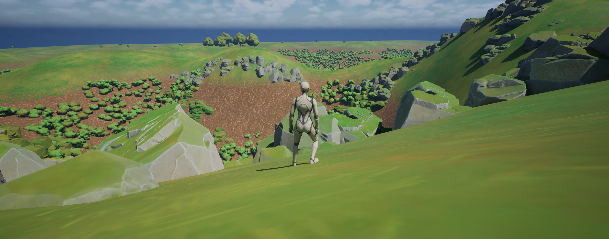
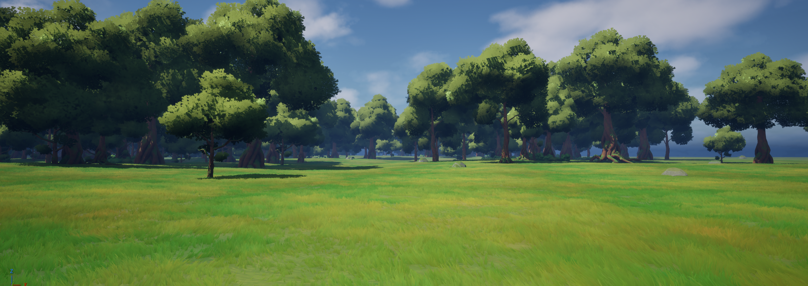
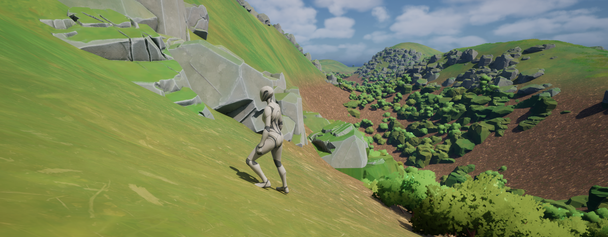

# 👋 Mickael D. Pernet

### Systems Architect & Core Developer
*Specializing in real-time systems architecture, procedural tooling & engine development*

I design and build software architectures, tools, and interactive prototypes that solve hard, real-time problems — from procedural world frameworks and desktop applications to backend services, data pipelines, and AI engines. My T-shaped profile spans from engine-level procedural generation to complex enterprise IT audits.

---

# 🚀 Featured Project — Adaptive Procedural Worlds: Complete Procedural Game Systems

> From generation to gameplay. Built on the lore of an original in-progress novel — procedural generation serves a pre-existing coherent universe, not a generic sandbox. Data-driven hexagonal world system with procedural mesh generation, layered PCG biomes, adaptive gameplay hooks (quests, spawns, resources), and runtime tile streaming — built from scratch via a Generate → Bake → Fix pipeline, architected for production. Genre-agnostic at the data layer: RPG, strategy, colony-sim, exploration, and beyond.

  <table>
    <tr>
      <td align="center"><b>Procedural Generation</b></td>
      <td align="center"><b>Point Density (21M)</b></td>
      <td align="center"><b>Final Render Zoom</b></td>
    </tr>
    <tr>
      <td align="center"></td>
      <td align="center"></td>
      <td align="center"></td>
    </tr>
    <tr>
      <td align="center" colspan="3"></td>
    </tr>
    <tr>
      <td align="center" colspan="3"><em>Hexagonal grid — seamless 256 km² environment governed by unique tile IDs</em></td>
    </tr>
  </table>

### ✅ Implemented

- **Coordinate-based hex grid** with mathematically resolved neighbor mapping and runtime tile addition (parent + target face)
- **Geometry Script mesh generation** with Golden Ratio LOD scaling, validated to a 1 km tile radius
- **Layered PCG base** driven by biome + evolution state, with dynamic surface deformation computed per tile *(Niagara integration in progress for performance-optimized FX layer)*
- **Proxy / Final / Dynamic mesh separation**, anticipating a production HISM bake pipeline
- **Save / load persistence** with a per-tile data structure managed by a central manager Blueprint
- **Stress-tested to 21 M objects per world-segment**, identifying GPU driver-level bottlenecks (TDR / VRAM)
- **96 km² world generation stress test** — hex-by-hex sequential generation with active PCG, simulating runtime exploration with no delay despite active memory exceeding the target chunk radius
- **Sub-second per-tile editor recalculation** at radius 3 around origin

### 📸 Current State — In-Engine

  <table>
    <tr>
      <td align="center"></td>
      <td align="center"></td>
    </tr>
    <tr>
      <td align="center"><em>Panoramic vista — biome diversity at scale</em></td>
      <td align="center"><em>PCG forest — procedural vegetation density</em></td>
    </tr>
    <tr>
      <td align="center" colspan="2"></td>
    </tr>
    <tr>
      <td align="center" colspan="2"><em>Rocky terrain — biome transition and PCG rock/vegetation placement</em></td>
    </tr>
  </table>

### 🔧 In Progress / Roadmap

- **Niagara FX integration** — category-based hooks (vegetation, decay, atmospheric) driven by per-tile coordinate arrays
- **POI authoring** with PCG zone-clearing for hand-placed, polished content
- **Procedural POI & quest step distribution** — placement and progression driven by biome/evolution state
- **Distributed quest system** — scenario-driven quests randomly assigned as hexagons are explored
- **Basic combat system** — hit detection, enemy spawning tied to biome and evolution
- **Instanced dungeons** — self-contained encounter spaces triggered by POI exploration
- **Progression system** — crafting, combat progression, resource gathering
- **Rank-1 hex chunk loading** around the player; data layer designed to be multiplayer-ready
- **Core gameplay loop** — paid exploration revealing and persisting newly generated tiles with full state (biome, evolution, POIs, quest state, resources)
- **C++ migration** of performance-critical generation paths

---

> **Note:** This project is developed as part of **Archanum** — a personal initiative open to collaboration, with the option to evolve toward a studio structure if no other opportunity emerges. More public documentation and technical write-ups about the project coming ASAP.

---

# 🎓 Education & Professional Certifications

<table border="0">
<tr>
<td width="50%" valign="top">
<h4>🏛️ French Bachelor of Science (B.Sc.)</h4>
<strong>Computer Science — Programming</strong>

<em>Université Paris 8 | Graduated Mar 2023</em>

<ul>
<li><strong>Major GPA:</strong> 3.96 / 4.00</li>
<li><strong>Specialization:</strong> Development & Systems</li>
<li><strong>Honors:</strong> Graduated with High Honors</li>
</ul>
</td>
<td width="50%" valign="top">
<h4>🏛️ U.S. Master of Technology (M.Tech)</h4>
<strong>Computer Software Development</strong>

<em>OC (WSCUC Accr.) | Graduated Jan 2025</em>

<ul>
<li><strong>Model:</strong> 60 Credit Hours (CBE)</li>
<li><strong>Grading:</strong> Pass (100% Mastery required)</li>
<li><strong>Validation:</strong> 12 Projects (First-Attempt)</li>
<li><strong>Specialization:</strong> Software Architecture</li>
</ul>
</td>
</tr>
</table>

  
  
  

# 🎓 M.Tech — Professional Architecture Deliverables

*Ten competency-validated architecture engagements from my U.S. M.Tech, spanning **medical systems, multinational fintech, aerospace, international logistics, insurance, scientific publishing, media streaming, and web** — each grounded in recognized methodology (TOGAF / ADM, ISACA / COBIT, ITIL 4) with measurable delivery envelopes. Click any entry to expand.*

<b>Stakeholder Buy-in via a Secure, Tested Proof of Concept</b> — <em>As software architecture consultant for the MedHead Consortium (NHS-regulated medical institutions), built a working PoC for emergency hospital-bed reservation</em>

 

- **Architecture & security** — Spring Boot (Java 21) microservice-ready backend with mocked external APIs (GPS, hospitals); secured via JWT + CSRF + HTTPS/TLS, GDPR-compliant anonymized logging, SOLID dependency inversion, on-demand CI/CD through GitHub Actions.
- **Performance** — parallelized GPS calls (`ExecutorService` / FixedThreadPool) to remove the sequential bottleneck; JMeter load tests at **99.94% success**, **6.81 min** average, **200 ms** SLA.
- **Quality** — backend coverage **89% statements / 74% branches** (JaCoCo), frontend **88.3% / 95.2% functions** (Karma/Jasmine); unit + integration + E2E tests; **4/4 competencies validated** at defense.

<b>Coordinating a Development Team for Effective Delivery</b> — <em>As Scrum Master / transitioning agile project lead, for a crypto trading platform launch inside a multinational bank (50+ countries)</em>

 

- **Backlog & estimation** — breakdown into 6 milestones / ~30 work items, each scored for complexity (2–7 scale) and dependency-mapped, tracked via Kanban.
- **Agile planning** — Gantt sequencing work items and milestones, developer assignment by skill, 2-week sprints (target velocity ~30 pts), individual team constraints integrated.
- **Delivery framework** — team practices (pair programming, code review, CI/CD, testing), 3-level acceptance KPIs (project / feature / sprint), security requirements (SSL/TLS, OAuth2, RBAC, MFA, rate limiting), and an upskilling plan for a team of 5.

<b>Migration Roadmap & Secure Implementation Plan</b> — <em>As software architect for an aerospace-parts maintenance SME, scoped the migration of a fragmented legacy system to a unified target</em>

 

- **Zero-downtime cutover** using Strangler Fig + parallel-run patterns through a transitional architecture; consolidated 6 heterogeneous databases into Oracle in dependency order (suppliers → clients → orders → payments → tooling → production).
- **GDPR-by-design & security** — AES-256 at rest, HTTPS/VPN in transit, SSO + RBAC + 2FA, IDS; risk governed via ITIL 4 (PESTEL / SWOT / criticality matrix).
- **Delivery envelope** — 25 tasks / ~6 months / 11 roles, targeting 99.9% data integrity, 99.5% availability, <2s response; est. €150–200k.

<b>IS Architecture Audit & Standardized Target Design</b> — <em>As software architect / IS auditor for an international logistics company (6 offices) unifying its ERP</em>

 

- Comparative audit of 5 heterogeneous ERP-centric architectures (ISACA / COBIT 5); TOGAF gap analysis toward a cloud-native SaaS suite on a unified database, retiring the legacy core.
- Risk analysis (7D framework + probability × severity matrix) prioritizing 18 risks, followed by an 18-month phased rollout (POC, parallel migrations, change management).
- Technical-financial feasibility: validated budget ceiling (~€1.68M over 5 years) and projected savings (~€242k/year, +€82.5k/year after archive decommissioning).

<b>Maintainable & Scalable Enterprise Architecture (TOGAF / ADM)</b> — <em>As enterprise architecture sponsor for a sustainable-food startup blocked by technical debt and needing to scale</em>

 

- **Containerized microservices target** (Docker / Kubernetes), database-per-service behind an API Gateway — loose coupling and high cohesion to add features without regression.
- **Zero-interruption migration** via the Strangler Fig pattern and multi-version coexistence, on elastic AWS (Auto Scaling, RDS, Lambda, IAM) with a geode model for geolocated backend relevance.
- **Measurable contractual framing** — 99.9% availability SLA, <2s response, RPO 10 min / RTO 1h, tailored ADM + Lean/Agile culture — delivered as a PoC under a 6-month / $50,000 constraint.

<b>Architecture Governance & Risk Management</b> — <em>As software architect taking over an in-progress dossier, for a scientific research magazine migrating its monolithic DMS to microservices (development outsourced)</em>

 

- Designed the containerized microservices target (Docker / Kubernetes, NGINX API Gateway) with micro frontends (Single-SPA / Module Federation) integrated into the legacy PHP front, externalized IAM/SSO, OAuth 2.0, end-to-end TLS.
- Risk management framework: criticality matrix (7D + SWOT + probability/impact scales) with 6 prioritized risks, prevention factors, remediation plans, and assigned owners.
- KPI-driven steering with compliance thresholds (<500 ms response, <1% API error, 99.5% availability, 100% data migrated) and a non-conformity process (5-business-day resolution, escalation).

<b>Evaluating & Optimizing Enterprise Architecture against Business Needs</b> — <em>As software architect for a medical research institute adding secure real-time videoconferencing and collaboration</em>

 

- **Reasoned architecture choice** — SOA vs. Web service compared across 6 criteria (security, cost, compliance, functional fit, scalability, compatibility) → selected a **RESTful web service** architecture to reuse the existing stack at optimal cost.
- **Stack & components** — Angular / Spring Boot / PostgreSQL, reverse proxy isolating public and restricted access behind a firewall; **Jitsi Meet (WebRTC)** chosen after open-source benchmark, with SaaS fallback to reach 500 participants.
- **Compliance & security by design** — GDPR / HDS / HIPAA / ISO 27001 / ICH-GCP, encryption (HTTPS, SSL/TLS), role- and org-based access control, isolated guest mode; formalized through TOGAF ADM Phase C views.

<b>Technical-Debt Impact Analysis & Standards-Based Architecture Modeling</b> — <em>As software architect for a life insurer whose IS grew as a 30-year patchwork (single engagement, two deliverables)</em>

 

- **Debt mapping** — per-service inventory from technical audit: obsolete technologies (COBOL + SQLite in legal, Java SE 7 applet/servlet in billing, Vue.js/PHP Symfony in sales, shared-folder-synced Access in customer service) and associated risks (security holes, single-person manual backups, data redundancy/inconsistency).
- **Debt translated into scope constraints** — data profiling and MDM rules for migration, legacy retained for compliance/archival, progressive debt repayment framed at 6 months / €200k; risk quantified via probability × severity, 7D spectrum, and SWOT with assigned owners.
- **Standards-based representation** — Tailored TOGAF framework (selected ADM phases, deliverables, governance interfaces) and a multi-layer **ArchiMate** Architecture Definition Document; target is containerized, event-driven, zero-trust microservices with IAM (Keycloak) and API Gateway, aligned to ISO 27001, GDPR, ISO 9001, WCAG.

<b>Architecture Framing & Requirements (Statement of Architecture Work)</b> — <em>As software architect for a media production company launching an interactive video-streaming platform</em>

 

- Translated ~10 interactive features (360° video, branching narration, dynamic content generation, secure streaming) into functional requirements and technical constraints: scalability, interoperability, GDPR compliance.
- Defined measurable acceptance criteria (KPIs): satisfaction ≥ 90%, availability ≥ 99.9%, server response ≤ 2s, ×10 scale-up capacity.
- Roadmap structured across 3 horizons (short / medium / long term) framing a BDD approach and an evolutive cloud strategy.

<b>Managing Requirement Changes in an Architecture Project</b> — <em>As software architect for a web design agency facing a new client data-sovereignty requirement</em>

 

- **Microservices redesign** — migration from a centralized monolithic web server to microservices behind an API Gateway (routing, JWT, performance metrics), with database-per-service isolation and centralized IAM (JWT access/refresh, MFA, least privilege).
- **Answer to the key business constraint** — client ownership and hosting of data — via a client-side software component: local configurations, secure updates (HTTPS/TLS + digital signature), progressive zero-downtime deployment.
- **Scoping & trade-offs** — RACI matrix over ~10 stakeholders, ~50 planned user stories (Kanban + Gantt), costed freelance budget (~€181k, day-rate × days per task); deliberate exclusion of non-standard clients to preserve architectural coherence.

---

# 🛠️ Portfolio & Projects

## 🏛️ Enterprise Architecture & IT Governance

* **[IT-Governance-Legacy-System-Modernization](https://github.com/MickaelDP/it-governance-legacy-system-modernization)**
> *Strategic Architecture (2023–2026):* Modernization roadmap for a legacy logistics system. Functional specs, a TOGAF-inspired governance plan, and a C-level pitch for a secure ASP.NET / iOS ecosystem.

* **Smart Property Management Platform (Architecture with IoT)**  *(private)*
> Architected the migration of a scalable property management and logistics system toward a cloud-native IoT stack. Led the feasibility study, resulting in a documented no-go decision based on critical technical and business constraints. (Demonstrates architecture-level judgment and ability to safeguard capital by preventing high-risk, low-ROI migrations.)

## 🏗️ Core Computing & Systems

* **[Paper-CPU-Von-Neumann-Architecture-Simulator](https://github.com/MickaelDP/Paper-CPU-Von-Neumann-Architecture-Simulator)**
> *ISA Simulation (2020):* C-based virtual CPU implementing a custom 8-bit Von Neumann architecture. Modular execution engine with an interactive stepper / debugger.

* **[MyShelf — A custom Unix Shell](https://github.com/MickaelDP/MyShelf-A-custom-Unix-Shell)**
> *System Architecture (2019 / 2026):* C-based Unix shell demonstrating core OS concepts, refactored for memory stability.

* **[Text-Adventure-DSL-Interpreter](https://github.com/MickaelDP/Text-Adventure-DSL-Interpreter)**
> *Custom DSL & NLP Engine (2022 / 2026):* Multi-layered SLY-based pipeline (lexer / parser) interpreting natural-language commands. Domain-agnostic core with lazy evaluation for complex state management.

* **[SeaWar — Terminal Tactical Battle](https://github.com/MickaelDP/SeaWar-Terminal-Tactical-Battle)**
> *Game Engine & AI (2021 / 2026):* Java naval tactical engine using OOP design patterns and MVC. Multi-state heuristic AI (Hunt & Target) with a custom retro TUI.

## 💼 Business Tools & Desktop Apps

* **CNET-Hour-Tracker** *(private)*
> *Production-Ready Desktop Application (2025):* Professional activity tracking with a PyQt6 / PySide6 interface, SQLAlchemy (SQLite) persistence, and an automated Excel / OpenPyXL reporting engine for compliance auditing. Memory-safe, fully tested via Pytest.

## 🤖 Artificial Intelligence & Research

* **[Logic-Programming — Inference Engines (Prolog)](https://github.com/MickaelDP/Logic-Programming---Inference-Engines--Prolog-)**
> *Logic & Optimization (2020 / 2026):* Declarative paradigm in SWI-Prolog. Interactive rule-based expert system and a Magic Square solver optimized with Constraint Logic Programming (CLP:FD).

* **[Custom-HTTP-Stack — Symbolic NLP Middleware](https://github.com/MickaelDP/Custom_HTTP_Stack-Symbolic_NLP_Middleware)**
> *Symbolic AI & NLP (2020):* From-scratch ELIZA chatbot engine and a custom HTTP stack in Common Lisp, bridging stateless web protocols with stateful symbolic logic.

* **[SOM-Kohonen-C-Engine](https://github.com/MickaelDP/SOM-Kohonen-C-Engine)**
> *From-Scratch AI (2022 / 2026):* High-performance Self-Organizing Map in C99. Memory-safe (Valgrind-verified), optimized for high-dimensional clustering (Fisher's Iris, Palmer Penguins).

* **[Deep-RL-Sim-Environments](https://github.com/MickaelDP/Deep-RL-Sim-Environments)**
> *Research Synthesis (2022):* Exploration of DRL taxonomies and Sim-to-Real challenges.

## 📡 Data Engineering & Automation

* **[UScrap2Gather — Multithread Engine](https://github.com/MickaelDP/UScrap2Gather-Multithread-Engine)**
> *Data Pipeline (2022 / 2026):* Python / PySide6 tool for real-time scraping. Multi-threaded collection, PostgreSQL integration, campaign-management GUI.

* **[Hate-Speech-Detection-Analysis](https://github.com/MickaelDP/Hate-Speech-Detection-NLP-Pipeline)**
> Hybrid NLP engine for near-real-time French toxicity auditing. Combines unsupervised anomaly discovery (LOF / K-Means) with supervised deep learning (Transformers).

---

## 🧰 Tech Stack

### Languages & Logic

  
  
  
  
  
  
  

### Engine & Frameworks

  
  
  
  

### Architecture & Methodology

  
  
  
  

### Data & Tooling

  
  
  
  

### DevOps

  
  
  
  
  
  

<!---
MickaelDP/MickaelDP is a ✨ special ✨ repository because its `README.md` (this file) appears on your GitHub profile.
You can click the Preview link to take a look at your changes.
--->
