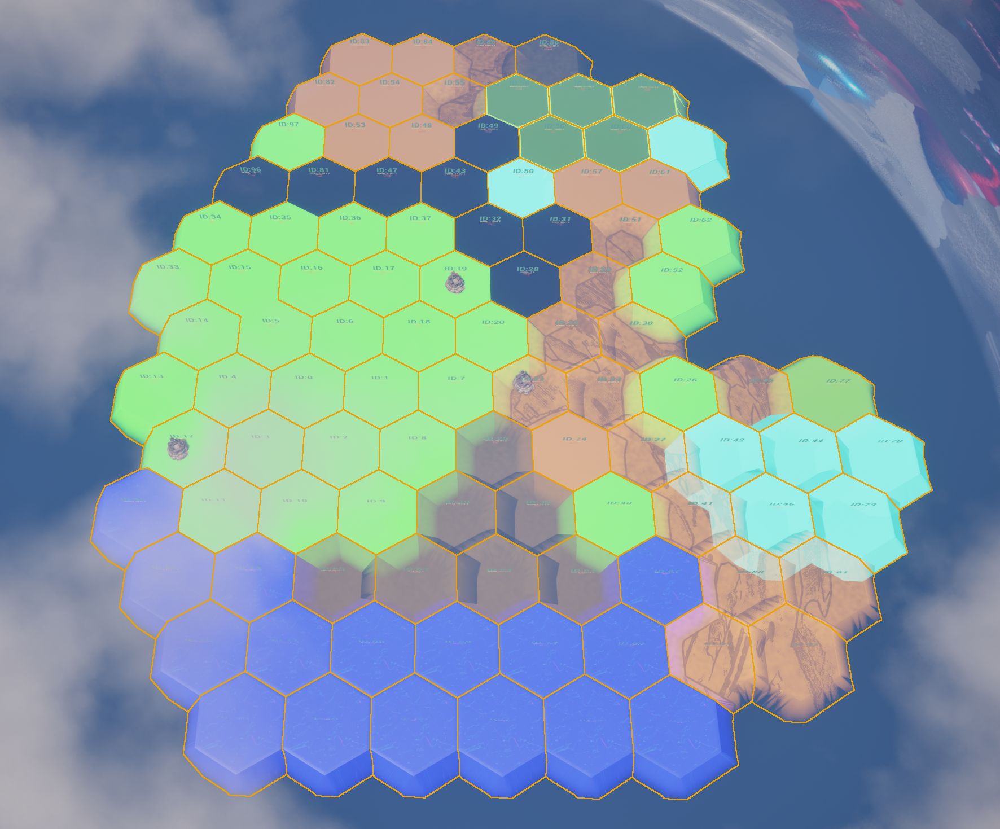
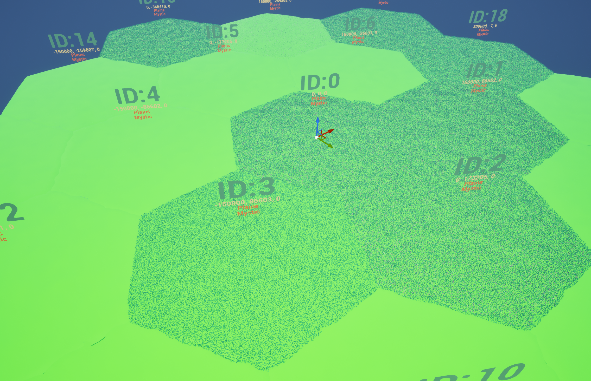
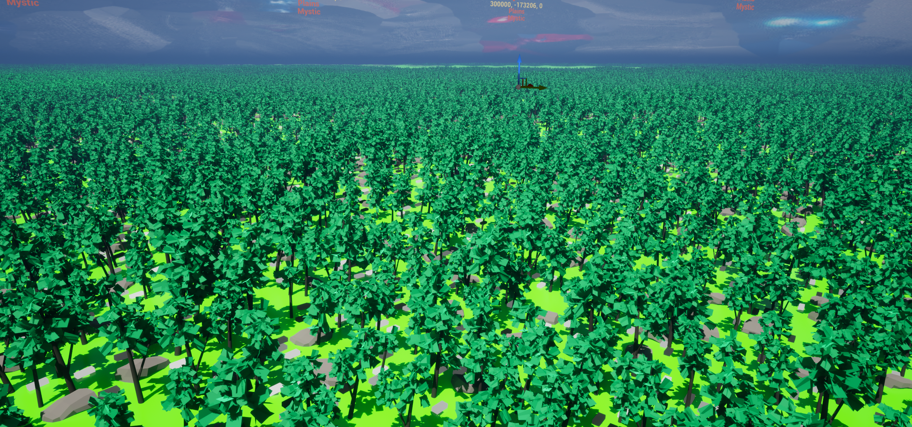

### 👋 Hey, I'm Mickael D. Pernet

---

### Software Engineer • Software Architect • Builder

I design and build software systems, tools and prototypes — from desktop applications to backend services and interactive concepts.

## 🎓 Education & Professional Certifications

<table border="0">
  
<tr>
<td width="50%" valign="top">
<h4>🏛️ French Bachelor of Science (B.Sc.)</h4>
<strong>Computer Science - Programming</strong>

<em>Université Paris 8 | Graduated Mar 2023</em>

<ul>
<li><strong>MAJOR GPA:</strong> 3.96 / 4.00 </li>
<li><strong>Specialization:</strong> Development & Systems</li>
<li><strong>Honors:</strong> Graduated with High Honors</li>
</ul>
</td> 
<td width="50%" valign="top">
<h4>🏛️ U.S. Master of Technology (M.Tech)</h4>
<strong>Computer Software Development</strong>

<em>OC (WSCUC Accr.) | Graduated Jan 2025</em>

<ul>
<li><strong>Model:</strong> 60 Credit Hours (CBE) </li>  
<li><strong>Grading:</strong> Pass (100% Mastery required) </li>
<li><strong>Validation:</strong> 12 Projects (First-Attempt)</li>
<li><strong>Specialization:</strong> Software Architecture </li>
</ul>
</td>

</tr>
</table>

  
  
  

 

---

# 🛠️ Portfolio & Projects

## 🏛️ Enterprise Architecture & IT Governance

* **[IT-Governance-Legacy-System-Modernization](https://github.com/MickaelDP/it-governance-legacy-system-modernization)**
> *Strategic Architecture (2023/2026):* Modernization roadmap for a legacy logistics system. Includes functional specs, a TOGAF-inspired governance plan, and a C-level pitch for a secure ASP.NET/iOS ecosystem.

## 🏗️ Core Computing & Systems

* **[Paper-CPU-Von-Neumann-Architecture-Simulator](https://github.com/MickaelDP/Paper-CPU-Von-Neumann-Architecture-Simulator)**
>  *ISA Simulation (2020):* A C-based virtual CPU implementing a custom 8-bit Von Neumann architecture. Features a modular execution engine and an interactive stepper/debugger.

* **[MyShelf-A-custom-Unix-Shell](https://github.com/MickaelDP/MyShelf-A-custom-Unix-Shell)** 
>  System Architecture: C-based Unix Shell demonstrating core OS concepts, originally built in 2019 and refactored for memory stability in 2026.

* **[Text-Adventure-DSL-Interpreter](https://github.com/MickaelDP/Text-Adventure-DSL-Interpreter)** 
>  Custom DSL & NLP Engine (2022/2026): A multi-layered SLY-based pipeline (Lexer/Parser) interpreting natural language commands. Features a domain-agnostic core and lazy evaluation for complex state management.

* **[SeaWar-Terminal-Tactical-Battle](https://github.com/MickaelDP/SeaWar-Terminal-Tactical-Battle)**
> *Game Engine & AI (2021/2026):* A Java-based naval tactical engine implementing **OOP Design Patterns** and MVC principles. Features a multi-state heuristic AI (Hunt & Target logic) and a custom TUI with a retro scientific calculator aesthetic.

## 💼 Business Tools & Desktop Apps
* **CNET-Hour-Tracker** [PRIVATE]
> **Production-Ready Desktop Application (2025)**: A production-ready desktop application for professional activity tracking. Features a robust PyQt6/PySide6 interface, SQLAlchemy (SQLite) persistence, and an automated Excel/OpenPyXL reporting engine for compliance auditing. Memory-safe and fully tested via Pytest.

## 🤖 Artificial Intelligence & Research
* **[Logic-Programming-Inference-Engines-Prolog](https://github.com/MickaelDP/Logic-Programming---Inference-Engines--Prolog-)**
> **Logic & Optimization (2020 / 2026)**: A showcase of the declarative paradigm using SWI-Prolog. Features an interactive rule-based expert system and a Magic Square solver optimized with Constraint Logic Programming (CLP:FD) to handle high-dimensional search spaces.

* **[Custom-HTTP-Stack-Symbolic-NLP-Middleware](https://github.com/MickaelDP/Custom_HTTP_Stack-Symbolic_NLP_Middleware)**
> Symbolic AI & NLP (Licence/Bachelor Legacy 2020): A from-scratch implementation of the ELIZA chatbot engine and a custom HTTP stack in Common Lisp. This project explores the roots of Conversational AI by bridging stateless web protocols with stateful symbolic logic.

* **[SOM-Kohonen-C-Engine](https://github.com/MickaelDP/SOM-Kohonen-C-Engine)**
> **From-Scratch AI (2022/2026)**: A high-performance Self-Organizing Map implementation in C99. Memory-safe (Valgrind verified) and optimized for high-dimensional clustering on datasets like Fisher's Iris and Palmer Penguins.

* **[Deep-RL-Sim-Environments](https://github.com/MickaelDP/Deep-RL-Sim-Environments)** 
> **Research Synthesis (2022)**: Exploration of DRL taxonomies and Sim-to-Real challenges.

## 📡 Data Engineering & Automation
* **[UScrap2Gather-Multithread-Engine](https://github.com/MickaelDP/UScrap2Gather-Multithread-Engine)**
> Data Pipeline (2022/2026): A robust Python/PySide6 tool for real-time Twitter scraping. Features multi-threaded collection, PostgreSQL integration, and a sophisticated GUI for campaign management.

* **[Hate-Speech-Detection-Analysis](https://github.com/MickaelDP/Hate-Speech-Detection-NLP-Pipeline)**
> Hybrid NLP engine for near real-time French toxicity auditing. Combines unsupervised anomaly discovery (LOF/K-Means) with supervised deep learning (Transformers) to bridge statistical patterns and semantic intent. Integrates [UScrap2Gather-Multithread-Engine](https://github.com/MickaelDP/UScrap2Gather-Multithread-Engine) ingestion and [
NLP-Exploratory-Pipeline-HateSpeech
](https://github.com/MickaelDP/NLP-Exploratory-Pipeline-HateSpeech) .

## 🚀 Current Focus

# Engine Tooling & Procedural Architecture (PCG):

* **Scalable World-Building Framework (Unreal Engine 5)**
> Infinite Data-Driven Hexagonal Grid: Architected a coordinate-based system managing tiles with a 1km radius, enabling the generation of maps with virtually no physical limits.
> *Scalability Proof: Current deployment example manages a seamless 256km² environment governed by unique tile IDs.

  <table>
    <tr>
      <td align="center">
<strong>Evolution de la Grille (256km²)</strong>
</td>
    </tr>
    <tr>
      <td align="center"></td>
    </tr>
  </table>

* **High-Density Stress Testing & Hardware Bottlenecks**
> Procedural Stress-Testing: Pushed boundaries to handle up to 21 million objects per world-segment, specifically identifying GPU driver-level limitations and hardware-specific bottlenecks (TDR/VRAM).

  <table>
    <tr>
      <td align="center"><b>Procedural Generation</b></td>
      <td align="center"><b>Point Density (21M)</b></td>
      <td align="center"><b>Final Render Zoom</b></td>
    </tr>
    <tr>
      <td align="center"></td>
      <td align="center"></td>
      <td align="center"></td>
    </tr>
  </table>

* **Optimization & Prototyping Pipeline**
> The "Generate > Bake > Fix" Workflow: Implementing a custom pipeline to convert live PCG data into optimized HISM (Hierarchical Instanced Static Meshes) for production-ready real-time performance.
> Advanced Prototyping: Leveraging a Generative AI pipeline to bridge the gap from initial concept art to high-fidelity 3D demo environments, streamlining the asset-to-engine transition.

* **Modernizing Systems: Applying Software Architecture patterns to legacy modernization and cloud-native transitions.**
---

## 🛠️ Tech Stack & Toolbox

### 💻 Languages & Logic

  
  
  
  
  
  
  

### 🏗️ Architecture & Tools

  
  
  
  
  
  
  

### 🛠️ Tools & DevOps

---

<!---
MickaelDP/MickaelDP is a ✨ special ✨ repository because its `README.md` (this file) appears on your GitHub profile.
You can click the Preview link to take a look at your changes.
--->
